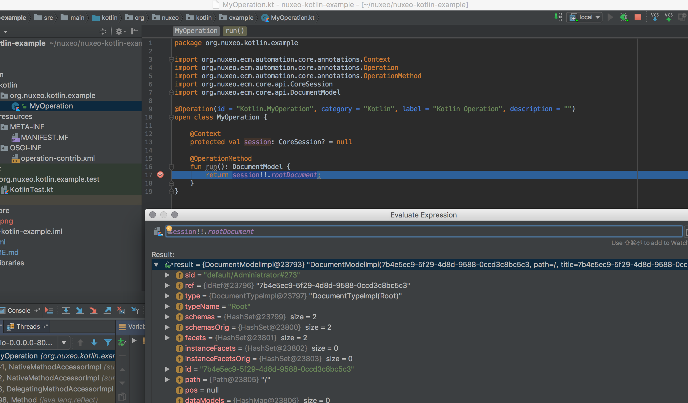

# Nuxeo & Kotlin


## The Rise

As we constantly strive to make the **Nuxeo Platform** better, more modern and efficient than ever, this time we turned our attention to rise of **Kotlin language**.

**Kotlin** is a statically-typed programming language that runs on the **Java Virtual Machine** and also can be compiled to JavaScript source code created by **Jetbrains**. It is designed to be an industrial-strength object-oriented language, and a "better language" than Java, but still be fully interoperable with Java code, allowing companies to make a gradual migration from Java to Kotlin.

With the last news of Google making possible to write in Kotlin any Android apps, the language becomes [a first-class one](https://techcrunch.com/2017/05/17/google-makes-kotlin-a-first-class-language-for-writing-android-apps/).

So we are pleased to announce today you can now develop in Kotlin your Nuxeo bundles!

## And Java?

Kotlin is fully interoperable with Java code and in one bundle you can compile both and make them work together!

## How it works?

### The structure

Like all Maven project structure, the Kotlin bundle is looking like a Nuxeo Java bundle. Except this time you can actually set a new folder `kotlin` for your Kotlin code:

```
├── pom.xml
└── src
    ├── main
    │   ├── kotlin
    │   │   └── org
    │   │       └── nuxeo
    │   │           └── kotlin
    │   │               └── example
    │   │                   └── MyOperation.kt
    │   └── resources
    │       ├── META-INF
    │       │   └── MANIFEST.MF
    │       └── OSGI-INF
    │           └── operation-contrib.xml
    └── test
        └── org
            └── nuxeo
                └── kotlin
                    └── example
                        └── test
                            └── KotlinTest.kt
```

Of course you can mix both Java and Kotlin for pleasure in the same bundle!

```
├── pom.xml
└── src
    ├── main
    │   ├── kotlin
    │   │   └── org
    │   │       └── nuxeo
    │   │           └── kotlin
    │   │               └── example
    │   │                   └── MyOperation.kt
    |   |__ java
    |   |   |__ org......
    │   └── resources

```

### The code

Here an example of a Kotlin Automation operation which will returned the definition of the root document:

```
package org.nuxeo.kotlin.example

import org.nuxeo.ecm.automation.core.annotations.Context
import org.nuxeo.ecm.automation.core.annotations.Operation
import org.nuxeo.ecm.automation.core.annotations.OperationMethod
import org.nuxeo.ecm.core.api.CoreSession
import org.nuxeo.ecm.core.api.DocumentModel

@Operation(id = "Kotlin.MyOperation", category = "Kotlin", label = "Kotlin Operation", description = "")
open class MyOperation {

    @Context
    protected val session: CoreSession? = null

    @OperationMethod
    fun run(): DocumentModel {
        return session!!.rootDocument;
    }
}
```

Of course this operation is registered in an XML extension and mentioned in the MANIFEST like any other Nuxeo bundle.

### The Maven build plugin

Once you have this structure and your code, just add the `kotlin-maven-plugin` mvn build plugin to compile properly and selecting accordingly the source location paths like in [this example](https://github.com/vpasquier/nuxeo-kotlin-example/blob/master/pom.xml#L38-L74).

### The deployment

Like any other Nuxeo bundle, you can build your project by running `mvn install` and put the bundle inside of your `NUXEO_HOME/nxserver/bundles` folder.

But before starting the Nuxeo server, don't forget to set in `NUXEO_HOME/nxserver/lib` the related [Jetbrain Kotlin Runtime library](https://mvnrepository.com/artifact/org.jetbrains.kotlin/kotlin-runtime). (this one is enough for a start, but you can also set the annotation one, stdin, reflect...)

- Start your server
- Run the following command:

```
curl -H 'Content-Type:application/json+nxrequest' -X POST -d '{"params":{},"context":{}}'   -u Administrator:Administrator http://localhost:8080/nuxeo/api/v1/automation/Kotlin.MyOperation
```

- Get the result!

### How to debug?

And if you run again this command you can like in Java debug quickly your code in Kotlin and in even in through both codes in the application!



### Tests?

Checkout the new **Kotlin Nuxeo Generator** below to know how to unit test like in Java but this time with **Kotlin** in a **Nuxeo** bundle!

## Getting Started

### Kotlin Nuxeo Generator

